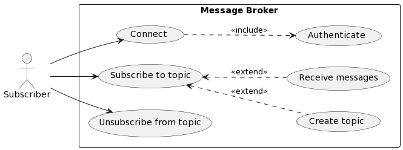
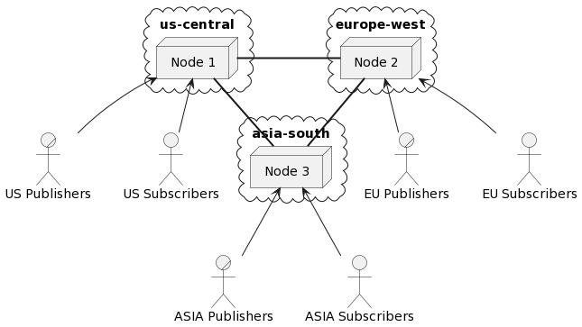
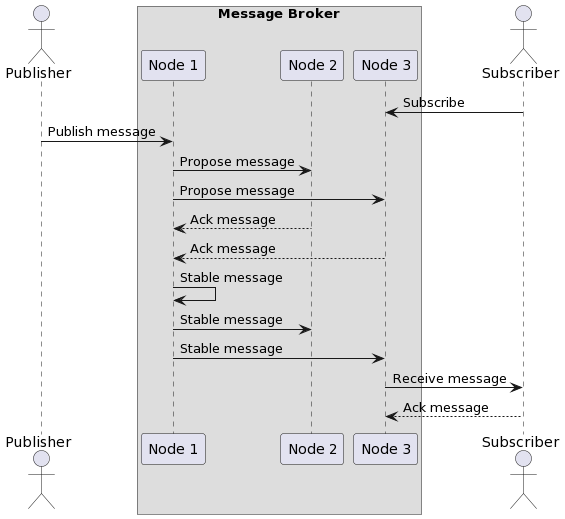
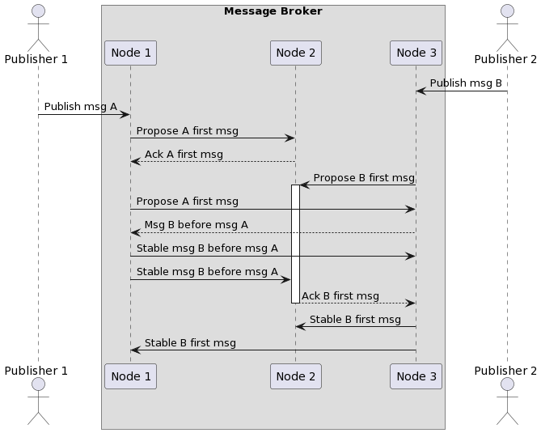

# Geo Distributed Message Broker

This project is still in development and does not meet all requirements outlined below.  

To run the message broker in it's default configuration:
```bash
docker compose up --build
```

Message broker nodes will be available on `localhost:8070`, `localhost:8080`, and `localhost:8090`.  
Interact with them using gRPC client of your choice:
```proto
syntax = "proto3";

package broker;

service Broker {
    rpc Publish (PublishRequest) returns (PublishResponse);
    rpc Subscribe(SubscribeRequest) returns (stream MessageResponse);
}

message PublishRequest {
    string topic = 1;
    bytes body = 2;
}

message PublishResponse {
    string id = 1;
}

message SubscribeRequest {
    map<string,int64> topics = 1;
}

message MessageResponse {
    string id = 1;
    int64 timestamp = 2;
    string topic = 3;
    bytes body = 4;
}
```

## Thesis Project Proposal

### Topic
Cloud-native fault-tolerant message broker, part of toolchain for geo-distributed systems

### Subject
Design and implement a distributed, fault-tolerant message broker system that leverages consensus algorithms for ensuring reliability and consistency across a wide area network. This project aims to address the needs of organizations requiring a highly available and dependable messaging infrastructure within the scope of geographically distributed systems.

### Objectives
- Ensure the message broker reliably handles message publishing and delivery under various conditions.
- Incorporate a consensus algorithm for managing distributed state and ensuring data consistency among nodes.
- Develop native support for gRPC communication to enable efficient and secure inter-service interactions.
- Design the system to be horizontally scalable to accommodate increased message volumes and evolving infrastructure needs.
- Create comprehensive documentation outlining system architecture, configuration, and deployment guidelines for users.
- Implement security measures to protect the system from unauthorized access, ensuring data confidentiality and integrity.

## Requirements

### Subscriber Requirements
1. The system must provide authentication mechanisms for subscribers, ensuring secure access to
topics.
2. Subscribers should have the ability to subscribe to specific topics of interest, allowing them to
receive relevant messages.
3. Subscribers must be able to unsubscribe from topics when they no longer wish to receive
messages from those topics.
4. Subscribers should be able to receive messages from the subscribed topics, enabling them to
process the messages as needed.
5. Subscribers should be able to receive messages from the nearest data center in the geo-distributed
network to minimize latency and enhance the real-time nature of their applications.



### Publisher Requirements
1. The system must provide authentication mechanisms for publishers, ensuring secure publishing
of messages to topics.
2. Publishers must be able to create new topics in the message broker for effective message categorization and publishing.
3. Publishers should be able to publish messages to specific topics, with the message broker
ensuring reliable message delivery to subscribers.
4. Publishers should be able to publish messages to the nearest data center in the geo-distributed
network to minimize latency.


### Developer Requirements
1. Developers should have access to comprehensive documentation that explains the message
broker’s features, capabilities, and usage.
2. Developers must be able to configure the message broker with various settings, including security, replication, and geo-distribution options.
3. Developers should be able to deploy the message broker using a Docker image, simplifying
scalability and management across different environments.
4. Developers should be able to manage the scalability of the message broker network by dynamically adding or removing nodes based on traffic demands.


### Non-Functional Requirements

| Requirement | Target Value |
| --- | --- |
| Throughput | The system should support a message throughput of 1,000 msgs/sec (when using multiple topics). |
| Latency | Latency with no more than 50 milliseconds delay between message publishing and delivery, under typical load conditions. |
| Scalability | Linear horizontal scalability: Proportional increase with new nodes across different geographical regions. Vertical scalability: Support hardware upgrades for nodes in various regions. |
| Fault Tolerance | Ensure that the message broker can continue to operate with minimal performance degradation even in the presence of node failures or network interruptions. |
| High Availability | Aim for at least 99.99% uptime over a year (approximately 52 minutes of downtime per year). |
| Consistency | Guarantee strong consistency and data integrity across all nodes, ensuring that messages are delivered in the order they were published. |
| Security | Implement measures to protect against unauthorized access and data breaches, while maintaining minimal impact on system performance. |
| Load Balancing | Ensure clients can publish or receive messages from nodes near their geographical area. |
| Message Retention and Cleanup | Configurable message retention with automatic cleanup. |
| Message Delivery Guarantee | Guarantee at-least-once delivery of messages. |
| Message Ordering Guarantee | Guarantee in-order delivery of messages. |
| Message Durability | Guarantee message durability in the event of node failures. |
| Interface | Provide gRPC interface for clients to publish and receive messages. |
| Logging | Support logging for system administrators to monitor the health of the system. |
| Deployment | Provide a deployment mechanism to deploy the system on any cloud platform. |

## Architecture

### Component Diagram


### Deployment Across Multiple Regions


<!-- ### Consensus No Conflicts


### Consensus With Conflicts
 -->